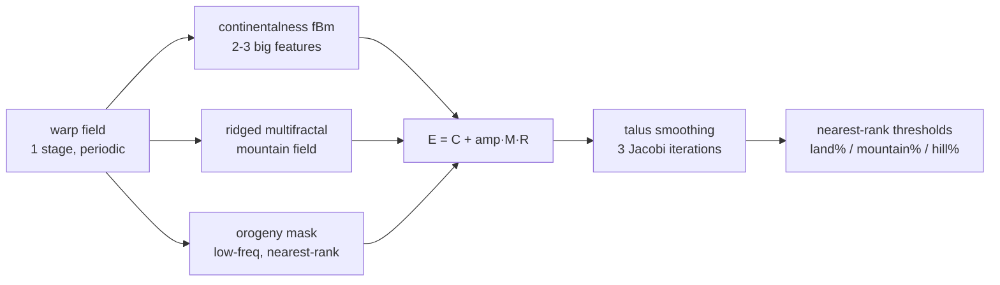
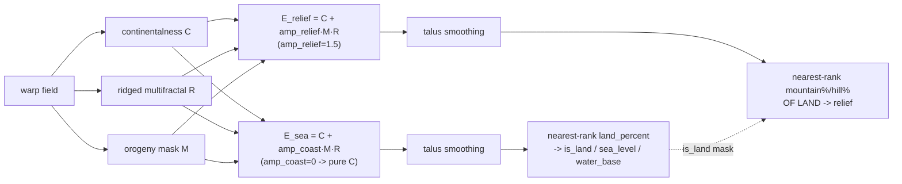

# Terrain Model & World Generation Redesign — v0.6.0

> **IMPLEMENTED**: v0.6.0, 2026-08-23 — series P1–P8 complete (plus D24–D26 amendments); fingerprints frozen on the Erik-inspected seed-42 worlds. Settings manual: `worldgen_settings.md`.
> **Status**: **v3 — final, handover contract for implementation.** Adversarial critique passed (4 lenses: determinism/portability, architecture/contracts, scope/regression, systems-reuse; 2026-08-22); E1–E6 resolved with Erik same day, recommendations adopted verbatim. Patch plan in §11.
> **Issues bundled**: #36 (terrain model), #10 (starting locations), #13 (Cartesian noise), #14 (latitude bias / rivers) — plus ten latent fixes found during orientation and critique (§9).
> **Invalidation**: one deliberate event — every seeded world changes. Version bump to **0.6.0**, golden tests re-baselined, scenarios archived and re-painted (§8). Closes the #35 land-before-the-1k-baseline bucket.

---

## 0. Post-critique decisions (E1–E6) — resolved with Erik, 2026-08-22

| # | Question | Decision |
|---|---|---|
| E1 | **Kernel homes & lasting names.** Three critique lenses independently found the same wall: pure mapgen cannot import `game/`, yet hex math, yield composition, the `on`-constraint evaluator, and fresh-water queries are declared singular and live (or were drafted to live) on `Map`/`Tile`. Fix: pure leaf modules that both sides import. | Create **`civulator/hexmath.py`** (directions, wrap-aware distance, adjacency, axial↔Cartesian centers — pure functions parameterized by width; A* stays on `Map`) and **`civulator/terrain_model.py`** (the `compose()` function + `on`-constraint evaluator, config-fed, pure). `Map`/`Tile` delegate to both; mapgen imports both. Canonical hex-math row's "Where" is amended at implementation. |
| E2 | **Scenario persistence & painter scope.** The doc told two stories (store tiles vs rebuild from seed). | Scenarios stay **seed + manifest-pinned mapgen params + entities** (§8 gate); the painter does **not** gain terrain editing in 0.6 — `ACCEPTED GAP`, revisit if authoring needs it. Tests/tools build controlled worlds through a sanctioned `Tile.set_layers(base, relief, feature, resource)` API (validates, recomposes, bumps the terrain epoch). A code-generated, manifest-stamped fixture scenario replaces `scenario_001.json` in tests. |
| E3 | **A* and the river crossing cost.** Rivers' only gameplay effect (+1 crossing, hardcoded twice in `unit.py`) is invisible to A* (per-tile cost grids, C++ and Python) — live inconsistency the day rivers ship. | **Extend both A* implementations with per-edge river costs** (river edge flags passed alongside the cost grid; own oracle-gated patch P6; C++ signature change → `cpp/` in blast radius). |
| E4 | **Renderer geometry.** `hex_render.hex_to_pixel` draws an offset layout on axial indices without converting — measured: **~17% of neighbor pairs render non-adjacent**. Your §8 inspection, isotropy eyeballing, and river polylines would all pass through a false lens. | **Amended after focused research (Erik's skepticism of the first fix was correct): store axial, render a pointy-top brick RECTANGLE** — axial→odd-r offset column taken **mod W** (full spec §7.5). Supersedes the earlier "true axial embedding" (a parallelogram leaning H/2 columns). Verified: 0 broken adjacencies at 24×12 and 106×66. Orientation is *forced* pointy-top (no flat-top fix exists on a horizontal-wrap cylinder). River primitive unaffected; painter/recorder/watch display rivers. |
| E5 | **Defaults for tools and tests.** `[map] type` is a dead key today; the constructor default silently decides what painter/recorder/tests get. Earthlike + starts is unanalyzed below Duel. | `[map] type` becomes a real, read key. **Earthlike minimum size = Duel (24×12)**; below it `generate` raises. Painter default board moves 16×16 basic → **Duel earthlike**. Tests keep explicit `map_type="basic"` at any size; engine-level golden runs **Duel earthlike**. Start failure after the retry ladder **raises deterministically** — no silent degradation. **D26 (P7.5) refines the LAST clause only**: that raise is `mapgen`'s own, unchanged. What `GameEnvironment.reset` does with it now depends on whether the caller gave an explicit seed — `reset(seed=N)` still always propagates it (a specific seed never silently becomes a different world); unseeded `reset()` may catch it and resample a bounded, logged number of whole new worlds instead of raising immediately. |
| E6 | **Encoder semantics amendment.** "Frozen contract" was oversold: with composed costs, hills+woods (3) aliases impassable at the old clamp; defense re-pointing activates bonuses the engine never applied; masks gain terrain filtering for the first time. | Keep the **layout** frozen (25/27 ch) and document three value-semantics corrections: `MAX_TERRAIN_COST` 3→4 with impassable pinned to max (1.0 unique again, passable ≤ 0.75); defense from composed *current-tile* values (fixes the spawn-frozen-terrain skew, §9.7–8) with the normalizer clamped; masks add domain filtering (action-space change, §7). |

## 1. Summary and scope

`Tile.terrain_type` today is one flat enum conflating base terrain, relief, and features (Woods exists twice; "Grassland with Hills and Woods" is inexpressible). This redesign replaces it with a composable model — **base terrain × relief × single feature × single resource**, rivers staying on edges — and rebuilds world generation on a literature-backed noise pipeline that fixes the axial skew (#13), the directional streaks and missing polar climates (#14), and adds rivers, water, standardized map sizes, and Civ-6-style starting locations (#10).

**In scope**: the tile model split; water (Ocean/Coast/Lake) as generatable, land-impassable terrain; bonus-tier resources; the `civulator/mapgen/` package (noise, elevation, climate, biomes, rivers, features, resources, starts) plus the pure kernels `hexmath` and `terrain_model` (E1); map-size presets; domain-aware passability; config schema for all of it; the invalidation/re-baselining plan; ten latent fixes.

**Out of scope (deliberately)**: naval units / embarkation (a seam is laid, no mechanics), luxury and strategic resource *content* (schema-ready; they ship with amenities and tech respectively), Gathering-Storm-style grass/plains floodplains, richer state encoders (separate experiment, §7), erosion simulation, plate tectonics (wishlist), painter terrain editing (E2, `ACCEPTED GAP`).

**Governing principle for content**: *content ships with the mechanic that gives it meaning; systems ship schema-ready ahead of content.*

**Authority note**: numeric tables in this doc (yields, thresholds, sizes) are *initial config content*; after implementation, `config.toml` is authoritative and this doc records rationale.

## 2. Decisions log

D1–D17 decided with Erik in the design session; D18–D23 added by the critique synthesis (pending E-decisions where marked).

| # | Decision |
|---|---|
| D1 | Tile = `base_terrain` × `relief` × `feature` (≤1) × `resource` (≤1); rivers stay edges; `terrain_type` dies as stored state (derived label only) |
| D2 | Water is IN for 0.6: Ocean/Coast/Lake generated, impassable to the land domain |
| D3 | Mountains keep their base terrain underneath (Civ 6 style) |
| D4 | All five land features + water features Reef and Ice enter the model and validity matrix now |
| D5 | Bonus resources: system + content now (8 starter resources); luxury/strategic: schema only |
| D6 | All modifiers additive (movement, defense, LoS obstacle, yields); no caps; impassable is a flag, not cost 999 |
| D7 | Placement constraints unified: one `on`-matrix evaluator (in `terrain_model`, E1); `Tile` enforces through it; generator and painter place through the same evaluator |
| D8 | Passability is a unit↔tile relationship (movement domains); one canonical terrain-domain check (occupancy is a separate, existing concern) |
| D9 | Noise: periodic-lattice Perlin gradient noise at hex Cartesian centers, lowbias32 hash — no seam handling, no trig, bit-for-bit portable under the §4.2 discipline |
| D10 | Elevation: warp → continentalness + orogeny-mask × ridged multifractal → talus smoothing → percentile thresholds; octaves auto from map size |
| D11 | Biomes: smoothed-field Whittaker (temperature × moisture) with nearest-rank percentile thresholds + one synchronous majority-filter pass |
| D12 | Rivers: corner-junction flow accumulation (deterministic, dendritic); floodplains desert-only, deterministic; river moisture bonus (config knob) |
| D13 | Starts: map-first → equal-fertility regions → best candidate per region → additive normalization with bonus resources. **Supersedes #10's "build the map around the starts" sketch** |
| D14 | Map sizes: named presets carrying rows/cols and default/max players; Standard = 48×24, default 6 players; explicit rows/cols still override for tests and tool boards |
| D15 | Encoder: channel *layout* frozen (25/27); three documented value-semantics corrections per E6; richer encoder is a later separate experiment; 0.6 agents blind to resources/rivers |
| D16 | v0.6.0; rebuilds use **manifest-pinned mapgen params** (live config only generates new worlds); loaders refuse on missing/mismatched manifest with one shared override; scenarios archived to `scenarios/archive_v0.5/`; Erik inspects seed-42 before fingerprints freeze |
| D17 | `mapgen` is an independent pure package with a standalone preview CLI |
| D18 | Pure kernels `civulator/hexmath.py` + `civulator/terrain_model.py`; game and mapgen both import them (E1) |
| D19 | Mapgen randomness is per-tile coordinate-hashed everywhere (features, oasis, resources); sequential draws exist only in explicitly-specified sequential stages (start normalization, retry ladder) |
| D20 | The determinism contract is a written numeric discipline (§4.2): mix64 stage seeds, pinned stage DAG, nearest-rank order statistics, synchronous grid updates, total sort keys, no transcendentals/reductions in the deterministic path |
| D21 | Golden layer 1 fingerprints the **entire** `MapData` (SHA-256 over canonical serialization, including rivers with flow+flux, resources, fresh water, starts) with pinned in-test params |
| D22 | The C++ mapgen twin, when it comes, is fingerprint-gated and **replaces** — never a silent fallback (unlike the A* pattern) |
| D23 | River crossing cost becomes config (`[terrain.river] crossing_cost`), single-sourced; A* treatment per E3 |
| D24 | Renderer projection (E4 amendment): axial storage, pointy-top brick-rectangle display (axial→odd-r offset mod W), exact O(1) picking, adjacency-render invariant as a permanent unit test; the P2b human gate folds into P8 — one human gate for the whole series |
| D25 | **Split elevation (§4.3 amendment, P7.5).** One elevation field made "more land" and "more mountains" the same knob: the P6 sweep found `land_percent=0.45, mountain_amp=0.0` cut start-placement failure from 27.7% to 2.0% by producing 3-5 round continents instead of 24-79 fragments, but `mountain_amp=0.0` also deletes the ridged-multifractal signal entirely (scattered high points, not belts). Fix: two elevation fields sharing one set of warp/continentalness/ridged/orogeny components — **E_sea** (`mountain_amp_coast`, default 0.0 → pure continentalness) drives is_land/sea_level/water_base ONLY; **E_relief** (`mountain_amp_relief`, default 1.5, the original value) drives the mountain/hill relief cut over E_sea's land, AND is threaded to river junction altitudes (task brief: "rivers should source in the mountain belts") and temperature's lapse term (a documented judgment call beyond the letter of the brief — E_relief carries the only ridged signal in the system, so mountains would be climatically invisible otherwise). `land_percent` 0.35 → 0.45. Measured on the shipped code (900 seeds, 10-cell preset grid): 2.0% failure, elevated-class (mountain+hills) mean connected-component size 4.19 at Standard (vs. 46 amorphous/1.4 fragmented for the two single-field extremes), coasts statistically identical to continentalness-only. Decided with Erik 2026-08-24. |
| D26 | **Unseeded-reset resample policy (P7.5).** `mapgen`'s own retry ladder (§6.3, E5) is unchanged — it still raises `StartPlacementError` deterministically when exhausted. What changed is what `GameEnvironment.reset` does with that raise: `reset(seed=N)` (explicit seed) still lets it propagate unchanged — reproducibility means a specific seed either works or fails loudly, never silently becomes a different world. `reset()` (no seed) now catches it, logs a warning (seed drawn, attempt k/N), and resamples — draws the next master seed from the engine's own continuing RNG stream and tries a whole new world — bounded by new config `[map] max_world_retries` (default 10); exhaustion raises with a summary. Decided with Erik 2026-08-24. |

## 3. The tile data model

```python
class Tile:
    base_terrain: str   # Grassland | Plains | Desert | Tundra | Snow | Coast | Lake | Ocean
    relief: str         # flat | hills | mountain   (water is always flat)
    feature: str | None # ≤1 of: Woods | Rainforest | Marsh | Floodplains | Oasis | Reef | Ice
    resource: str | None# ≤1 of the resource table (0.6 ships bonus tier only)
    # rivers are NOT tile state — Map.rivers is the only river representation (edges)
```

- **Base terrains** (Civ 6 reference, researched in #36): Grassland, Plains, Desert, Tundra, Snow (land); Coast, Lake, Ocean (water). Snow becomes generatable for the first time (the corrected temperature model reaches freezing).
- **Relief** is a variant of the base, land only. Mountains keep their base underneath ("Desert (Mountain)").
- **Feature validity matrix** (initial content; authoritative form is the `on` constraints in config): Woods on Plains/Grassland/Tundra flat/hills; Rainforest on Plains flat/hills; Marsh on flat Grassland; Floodplains on flat Desert along rivers; Oasis on flat Desert (no river on-tile, no adjacent water/Oasis/Floodplains); Reef on Coast; Ice on polar Coast/Ocean.
- **`terrain_type` ceases to exist as stored state.** A derived label ("Grassland (Hills), Woods") serves display and debugging. Scenario files store *seed + params + entities* (E2); tile grids appear only inside `MapData` fixtures and golden tests.
- **Rivers**: `Map.rivers` (tile-pair edge set) is the single representation, now with flow direction and flux per edge. The dead `Tile.has_river()` is deleted; river queries go to the Map (fresh-water mask, §5).
- **Impassability, workability, settleability — three distinct predicates**: `impassable` (mountain relief flag) blocks everyone and makes a tile unworkable; **water is workable** (cities work Coast/Lake — Fish, future Fishing Boats) but is impassable to the land *domain*; `settleable` = land domain ∧ ¬impassable. City tile-assignment skips only unworkable tiles.
- **Mutation surface**: `Tile.set_layers(base, relief, feature, resource)` — the only way to change a tile after construction: validates via the `on` evaluator, recomputes composed properties, bumps `Map.terrain_epoch` (§3.4). Tests and tools use it; nothing writes layer fields directly.

### 3.1 Composition and the unified constraint system

Every gameplay property of a tile is the **sum of contributions** from its layers; the interpreter is `terrain_model.compose()` (E1), the tables live in config:

```toml
[terrain.base.Grassland]
yields = [2, 0]            # [food, production]
movement = 1               # base cost
defense = 0
los = [0, 0]               # [obstacle, vantage]
domain = "land"

[terrain.relief.hills]
yields = [0, 1]
movement = 1               # additive: Grassland hills costs 2
defense = 3
los = [1, 1]

[terrain.relief.mountain]
impassable = true          # replaces the 999 sentinel
los = [3, 0]

[terrain.feature.Woods]
yields = [0, 1]
movement = 1
defense = 3
los = [1, 0]
on = { bases = ["Plains", "Grassland", "Tundra"], relief = ["flat", "hills"] }

[terrain.resource.Wheat]
class = "bonus"
yields = [1, 0]
on = { bases = ["Plains"], relief = ["flat"], features = ["none", "Floodplains"] }

[terrain.river]
crossing_cost = 1          # per-edge; single-sourced (kills the unit.py hardcoding), A* per E3
```

- **Movement**: additive. **Defense**: additive, no cap. **LoS**: additive obstacle and vantage; mountain obstacle 3. **Yields**: additive `[food, production]`, clamped ≥ 0. Resources contribute yields only.
- **The `on` constraint is the single validity matrix**, evaluated by one function in `terrain_model`; `Tile` enforces via it, the generator chooses placements via it, the painter places via `Tile`. Improvements (today a hardcoded dict in `environment.py`) migrate to the same formalism, with `env.build_improvement` as a named consumer.
- Dying config: `[map.terrain_weights]`, `[map.features]`, `[terrain.movement_costs]`, `[terrain.defense_modifiers]`, `[terrain.los]`, and `Terrain.PRODUCTION_VALUES` (code). Dead keys becoming real: `[map] type`, `[game] starting_warriors`, `[game] min_city_distance` (§9.10).

### 3.2 Resources

Bonus tier ships in 0.6 (initial content; config authoritative):

| Resource | Yields | Placement (`on`) |
|---|---|---|
| Wheat | +1f | flat Plains (or Floodplains) |
| Rice | +1f | flat Grassland, Marsh allowed |
| Cattle | +1f | flat Grassland |
| Sheep | +1p | hills (any land base) |
| Stone | +1p | Grassland flat/hills |
| Deer | +1p | Woods or Tundra |
| Bananas | +1f | Rainforest |
| Fish | +1f | Coast or Lake |

Luxury/strategic content arrives with amenities / tech respectively.

### 3.3 Passability: domains (the embarkation seam)

- Each base terrain has `domain = "land" | "water"`; each unit type has a movement domain (today all `land` — a sixth column in the unit data tables; the CLAUDE.md unit-system row gains it at implementation).
- **One canonical function for terrain-domain passability** (`unit.can_enter(tile)` / `terrain_model`): domain match + impassable flag. **Occupancy stays a separate concern** with its existing per-slot semantics — the canonical function answers "does the terrain admit this unit", not "is there room".
- **Pathfinding**: `path_finder(p1, p2, domain)` — the cost grid is built per domain via the canonical check and **cached per (map, domain, terrain_epoch)**, not per call. The C++ `hex_astar` wire format (`cost ≥ 99` = blocked) is retained as the **adapter encoding**: the sentinel is written by the grid *builder* from the flag; no gameplay code compares magic costs. The LoS guard at `map.py:266` re-points to the flag. (`cpp/` river-edge extension per E3.)
- **Masks**: `get_valid_moves_mask` gains the domain check — the first terrain filtering masks have ever had (today they check adjacency/slots/enemies only; the engine refused at execution). This **changes action-space semantics** (illegal-but-attemptable → unofferable) — acknowledged in §7. The recorder's highlighting inherits it via the shared masks; the masks' `game_env=None` fallback branch (unreachable from live code) is deleted as a rider.
- **Spawning goes through the same check**: warrior spawn at reset and `City.complete_unit_production` both place only on domain-passable tiles (§9.10); if `starts.py` guarantees are violated at engine level, `reset` **raises** instead of silently re-rolling.
- Future naval/embarkation = a new domain value + a capability check inside the one function.

### 3.4 Caches and the terrain epoch

`Map` gets a monotonically increasing `terrain_epoch` (bumped by `Tile.set_layers` and river mutations) and a process-unique `map_uid` (class counter — `id()` reuse after GC made the encoder's current cache key unsound). All terrain-derived caches key on `(map_uid, terrain_epoch)`: the LoS `_visible_cache`, the fresh-water mask, per-domain cost grids, and the encoder's terrain layer.

## 4. Map generation

### 4.1 The `civulator/mapgen/` package (D17, D18)

- **Core is pure**: numpy + stdlib + the pure kernels `hexmath` and `terrain_model` (E1). It imports nothing from `game/`, `viz/`, `agents/`. Dependency arrows: `game → mapgen → {hexmath, terrain_model} ← game`. All acyclic, all pure.
- **API**: `generate(seed, size, num_players, params) -> MapData`. `MapData` is a named contract (Systems (b)): base/relief/feature/resource grids, river edges with flow direction + flux, the fresh-water mask, start positions. Fields change only with a golden re-baseline.
- **The engine consumes it**: `Map.generate_map` builds `Tile`s from `MapData`; `GameEnvironment.reset` performs every mutation (capitals, warriors) — mapgen produces data, the environment remains the only mutator. Player-to-start assignment happens in `reset` via the engine RNG (as today's shuffle).
- **Generator selection**: `[map] type = "basic" | "earthlike"` becomes a real, read key (E5). Earthlike is the default for play, training, painter, scenarios; **minimum earthlike size is Duel (24×12)** — below it `generate` raises. `"basic"` (rewritten: iid bases + independent relief/feature rolls through the same `on` evaluator, **empty river set**, same starts stage, same `MapData` contract) exists for unit tests at any size, always requested explicitly.
- **Standalone preview**: `python -m civulator.mapgen --seed N --size standard`; the CLI `__main__` composes mapgen with `viz/hex_render` (fixed axial projection + river primitive per E4). Reroll seeds, dump PNGs.
- **Map statistics**: `mapgen/stats.py` — terrain-distribution, isotropy, river, and start-fairness metrics over generated map batches; every §10 map-quality oracle measures through it (Systems (b)).
- The March prototype (`map_generator_prototype.py`, `map_generator_notes.md`) is **archived** at implementation — superseded, and a standing rule violation if left at root.

### 4.2 Noise foundation and the determinism discipline (D9, D19, D20)

The prototype's streaks had three compounding causes: value noise (worst-in-class axis-aligned artifacts), raw (q,r) sampling (features stretched 1.73× along the ENE diagonal), and the 3D cylinder embedding. Seam-blending is documented as the worst tiling technique. The canonical stack:

- **Perlin gradient noise** (2002 scheme: hash → fixed gradient table, quintic fade). Periodic simplex (psrdnoise) is the documented upgrade path, decided by the isotropy oracle, not taste.
- **Exact single-axis periodicity by periodic lattice hashing**: wrap the integer lattice x-coordinate `ix mod P_k` inside the hash. No seam, no trig.
- **Hex-center sampling**: x = q + r/2 (from `hexmath`), y = r·√3/2; x-period = column count W; periodicity holds for all real x, so the stagger needs no handling.
- **Octaves**: per-octave integer periods P_k = m·2^k (coarsest m ≈ 3–4; finest ≥ ~2 columns/cell); lacunarity exactly 2; per-octave seeds + origin offsets.
- **Hash**: `lowbias32`, nested: `hash(wrapped_ix + hash(iy + hash(octave_seed)))`.

**The determinism contract is a discipline, not an aspiration** (critique: the v1 phrasing "stages are order-independent" overclaimed). The rules:

1. **Seeding**: `reset(seed)` makes **one documented draw** from `PortableRNG` → uint64 master seed (unseeded resets draw the next master from the engine stream, preserving `test_determinism` semantics). Stage seeds are `mix64(master_seed, stage_id)` (splitmix64-style — **not XOR**, which invites cross-seed stream collisions in sequential seed sweeps); octave seeds are `mix64(stage_seed, octave_index)`.
2. **Pinned stage DAG** (order is part of the contract): elevation → water/coast/lake → relief → raw moisture → rivers (flux from **raw** moisture) → moisture + river bonus → temperature → biomes → features → floodplains/oasis → resources → starts.
3. **Per-tile randomness is coordinate-hashed, never streamed** (D19): every independent stochastic decision (feature chance, oasis, resource placement) is `hash(stage_seed, r, q, purpose) < threshold` — local, order-free, insertion-stable. Genuinely sequential stages (start normalization, retry ladder) fully specify candidate enumeration order and tie-breaks.
4. **Thresholds are nearest-rank order statistics** (integer k, defined rounding; mountain/hill percents are fractions **of land**, land percent of the whole map) — never `np.percentile` interpolation. Thresholds then compare against actual field values.
5. **Grid iterations are synchronous (Jacobi)**: talus smoothing and the majority filter read the old grid, write a new one, fixed iteration counts; neighbor sums are written as pinned-order expressions. Planchon–Darboux uses the **ε-variant** (ε > 0 so flats always drain; ε and the jitter magnitude are config constants with ε ≫ jitter).
6. **Total sort keys everywhere**: any sort or argmax over floats carries lexicographic tie-breakers — junction processing `(altitude, r, q, N/S)`, start candidates `(score, r, q)`, bisection cuts likewise. Fertility weights are kept **dyadic** (1, 0.5, 2 …) so score sums are exact and order-independent.
7. **No libm transcendentals in the deterministic path** (pow/exp/log included — libm differs across platforms, Python-to-Python): ridged-multifractal spectral weights `pow(freq, −H)` are **precomputed at stage setup** from config, and with H=1/lacunarity 2 defaults they are exact powers of two; arbitrary H remains legal but its weights are computed once and recorded in the manifest params, making them part of world identity rather than per-tile arithmetic.
8. **No numpy reductions in the deterministic path** (pairwise-summation blocking varies by shape and build): accumulations that matter (river flux) run on **integer-scaled moisture** (fixed-point), making sums exact and order-free.
9. **Bit-identity scope**: the integer/hash layer is bit-exact by construction; the float layer is bit-exact *only under rules 4–8* plus per-tile fixed-order fade/lerp arithmetic and FP contraction off in C++ (`/fp:precise`, `-ffp-contract=off`; doubles only, no long-double intermediates). The **full-MapData fingerprint is the acceptance test** for any second implementation, and the C++ twin **replaces rather than falls back** (D22) — a silent fallback would make the world depend on whether a .pyd built.

### 4.3 Elevation pipeline (D10)

Structure comes from imposed low-frequency organization, not octave count (Musgrave: useful octaves = log₂(width) − 2):



Warp (one stage, warp field wraps → seam preserved); continentalness; Musgrave ridged fBm (offset 1.0, gain 2.0, H 1.0; spectral weights precomputed per §4.2.7) gated by the orogeny mask (upgrade slot: fault polylines); talus + one majority-vote cleanup; nearest-rank percentile thresholds. Octaves `clamp(round(log2(map_width)) − 2, 3, 9)` auto, config-overridable. **Coast** = water tile with ≥1 land neighbor; **Lake** = enclosed water body below a config size threshold (flood fill — component-based, order-independent).

**Split elevation (D25 amendment, P7.5).** The diagram above's single `E = C + amp·M·R` box is now built TWICE from the same shared warp/continentalness(C)/ridged(R)/orogeny-mask(M) components — a thin combine step (`elevation.combine_elevation`), not a second noise pass:



- **E_sea** (`mountain_amp_coast`, default 0.0 — degenerates to continentalness alone, floating-point-exact) drives `is_land`/`sea_level`/`water_base` (Coast/Lake/Ocean) ONLY.
- **E_relief** (`mountain_amp_relief`, default 1.5 — the original single-field value) drives ONLY the mountain/hill nearest-rank relief cut, restricted to E_sea's own land mask. It is ALSO the field passed to two other continuous-elevation consumers, both validated by measurement and documented at their call sites in `earthlike.py`: rivers' junction altitudes (§5 — "rivers should source in the mountain belts"), and temperature's elevation-lapse term (§4.4 — E_sea carries no ridged signal at all under the default `mountain_amp_coast=0.0`, so pairing the lapse term with it would make every mountain/hill tile climatically indistinguishable from the plain beside it). `sea_level` itself stays E_sea's single nearest-rank scalar threshold either way — only which continuous field pairs with that scalar changes.
- Setting `mountain_amp_coast` back above 0 restores the pre-D25 single-field behavior (mountains reshaping the coastline too); passing the same array as both `E_sea` and `E_relief` to `elevation.classify_land_and_relief` reduces it to exactly the pre-D25 computation.

### 4.4 Climate and biomes (D11)

- **Temperature** = latitude curve +1.2 (equator) → **−1.2 (poles)** (the #14.2 fix) − elevation lapse + low-frequency coherent wobble (band boundaries meander; no per-tile RNG).
- **Moisture** = low-frequency fBm + river bonus (§5), integer-scaled for flux (§4.2.8).
- **Classification**: smoothed-field Whittaker (temperature × moisture → base terrain), nearest-rank thresholds (starting numbers from PerfectWorld3: desert 0.36 / plains 0.56 rainfall percentiles; snow < 0.25, tundra < 0.30 temperature — expect retuning); one synchronous majority-filter pass (≥5 of 6 neighbors agree → adopt; land/water and relief exempt) as the speckle safety net.
- **Features**: placed by the `on` evaluator + per-tile hash chances (D19): Woods temperate, Rainforest hot+wet Plains, Marsh wet flat Grassland, Ice polar water, Reef warm Coast. Floodplains/Oasis after rivers (§5).

## 5. Rivers (D12, D23)

Corner-junction flow accumulation (PerfectWorld3 lineage), chosen over Civ's `DoRiver` walk for dendritic realism and RNG-free determinism:

- **Graph**: every tile owns its N and S corners — with cylindrical q-wrap this enumerates all *interior* corners exactly once; corners on the open r-boundary (owning tile off-map) don't exist, so boundary rows are river-free by construction (the §10 oracle expects this, not flags it). Junction altitude = min of its ≤3 touching tiles + deterministic jitter `hash(r, q, N/S)·δ` (δ ≪ ε).
- **Sink fill**: ε-variant Planchon–Darboux (§4.2.5). **Precondition: ≥1 ocean junction; an all-land world (basic, or land_percent = 1.0) skips the river stage entirely** — documented, and basic always ships an empty river set.
- **Flow + accumulation**: lowest strictly-lower neighbor, total key `(altitude, r, q, N/S)`; descending-altitude processing; flux sums integer-scaled moisture of adjacent tiles downstream.
- **Selection**: edges above the (1 − `river_percent`) nearest-rank flux quantile (~0.15–0.20) become rivers with flow direction + flux stored; rivers shorter than 2–3 edges suppressed.
- **Gameplay**: crossing cost from `[terrain.river] crossing_cost` (single-sourced; kills the double hardcoding in `unit.py`), A* treatment per E3.
- **Feedback**: **Floodplains deterministic** (every flat Desert tile touching a river edge); **Oasis** per-tile hash rolls (D19) under its `on` constraints, ~1% of land; **river moisture bonus** (+~0.1, config) applied to the post-river moisture field before biome classification; **fresh-water mask** computed **in mapgen** as a `MapData` field (start scoring needs it there — E1), surfaced on `Map` as the engine's only fresh-water query, cached under §3.4.

## 6. Starting locations and map sizes (D13, D14)

**Supersedes #10's sketch** (no shipped implementation builds the map around pre-placed starts; Civ 6 does the reverse). Adopted order:

1. **Fertility scoring**: per-candidate sum over rings 0–2 (ring 2 at half weight) of composed per-tile yields (via `terrain_model` — the same numbers the game plays with); fresh water heavily weighted (from the `MapData` mask), coastal half; **reject candidates with fewer than 3 domain-passable ring-1 tiles** (tightened from ⅔ — a start must be able to deploy its opening warriors); weights dyadic (§4.2.6).
2. **Region division**: recursive bisection of each landmass into contiguous equal-fertility regions, one per player (axis with larger fertility-weighted extent, cut at the fertility median, lexicographic tie-breaks). Degenerate cases (cylinder-wrapping or concave landmasses producing a disconnected side) fall back to connected-component splitting of the larger side — specified, deterministic.
3. **Placement**: best `(score, r, q)` candidate per region; pairwise distance ≥ **d_min = round(√(tiles/(players·3.5)))** computed at runtime from *actual* player count (the formula is authoritative; the table column below is illustrative at default players); soft crunch penalty; relax-and-retry ladder with specified order; **exhausted ladder raises deterministically** (E5) — no silent degradation, unchanged by D26: `mapgen.starts` itself never catches this or resamples anything — it is purely `GameEnvironment.reset`, one layer up, that now decides (per D26) whether that raise propagates (`reset(seed=N)`) or triggers a bounded, logged whole-world resample (unseeded `reset()`).
4. **Normalization — additive only, never terraform**: weak starts get bonus resources in rings 1–2 (fixed enumeration order) until food/production thresholds clear (scaled from Civ's). Bonus resources are load-bearing here.
5. **Engine contract**: `reset` places capitals on the delivered starts and spawns `[game] starting_warriors` (config key becomes live) through the domain check, spilling to ring 2 if ring 1 lacks room; it never re-rolls (§3.3).

**Size presets** (`[map.sizes.*]`; stored as **rows/cols** to kill the W×H transposition ambiguity; `[map] size` selects; `num_players` defaults from the preset; explicit rows/cols remain for tests and tool boards):

| Size | cols×rows | Total | Default / max players | d_min @ default |
|---|---|---|---|---|
| Duel | 24×12 | 288 | 2 / 3 | 6 |
| Tiny | 32×16 | 512 | 3 / 4 | 7 |
| Small | 40×20 | 800 | 4 / 6 | 8 |
| **Standard** | **48×24** | **1 152** | **6 / 8** | **7** |
| Large | 64×32 | 2 048 | 8 / 12 | 9 |
| Huge | 84×42 | 3 528 | 12 / 16 | 9 |
| Colossal (opt.) | 106×66 | 6 996 | 12–16 / 24 | 13 |

Standard keeps 48×24; its **default player count changes 8 → 6** (max 8 preserves today's density — and `test_starting_capitals` at 8 players becomes the max-density stress case, kept as an oracle). All five run scripts' divergent `num_players` fallbacks (2 vs 8 today) re-point to the preset default. Colossal equals Civ 6's Huge for 1:1 literature cross-checks.

## 7. What the agent sees (D15, E6)

- **The channel layout is frozen** (25/27); the values carry **three documented semantic corrections**, all listed in the CHANGELOG:
  1. **Cost channel rescale**: `MAX_TERRAIN_COST` 3 → 4, impassable pinned to max — saturation (1.0) uniquely means impassable again; passable composites (hills+woods = 3) sit at 0.75. Without this, oceans and forested hills alias — fatal on water worlds.
  2. **Defense activation**: per-unit defense reads composed *current-tile* values, fixing the engine's spawn-frozen `unit.terrain` and the encoder/engine disagreement (§9.7–8); the normalizer clamps and derives its max from config.
  3. **Mask filtering**: `get_valid_moves_mask` gains the domain check — the action space the agent sees shrinks (illegal → unofferable), changing exploration and the invalid-action reward stream. A representation-affecting change beyond "worlds changed", stated honestly.
- **Consequence, consciously accepted**: 0.6 agents are blind to resources and rivers. The **richer encoder** (base one-hots, relief, feature, resource, river channels — a subclass, never a fork) is a separate measured experiment, landing before any serious milestone-B baseline.

## 7.5 Renderer projection (E4 amendment — researched and numerically verified 2026-08-22)

**Decision (D24)**: storage stays axial (unchanged); the screen shows a **pointy-top brick rectangle**: convert axial → odd-r offset and take the offset column **mod W**. Three research findings force this exact shape:

1. **"Convert to offset" and "renormalize x mod W" are algebraically the same formula** — proper conversion alone reproduces the parallelogram; the rectangle is legal *only because q wraps* (the mod is the cylinder quotient's gauge freedom). Even rows land on integer columns, odd rows on half-integers: the classic brick pattern.
2. **Orientation is forced to pointy-top.** A seamless horizontal wrap needs the q basis vector horizontal; flat-top has no horizontal edge step, so its wrap identification carries a vertical offset of W/2 rows (12 rows on the painter, 53 on Colossal — panning east would drift the world south forever). The current flat-top art rotates to vertex-up hexes; sprites are unrotated centered icons, so no art changes.
3. **This mirrors Civ V's own architecture** (it stores the staggered rectangle and converts to axial for math; we store axial and convert to the rectangle for display) and Catlike Coding's hex-wrap treatment.

**Verified** (script preserved as the basis of the P2b unit test): 0 broken adjacencies at 24×12 and 106×66 (current renderer: 17.6%/16.9% of neighbor pairs render non-adjacent); analytic picking error-free including jittered points; seam splits render strictly at opposite screen edges (2 pairs/row) — the feared diagonal tearing does not occur (the cut is a fixed vertical line on the cylinder; it drifts only in stored-q space, invisible on screen).

**Drop-in formulas** (pointy-top; `S3 = √3`, `s` = hex size, `W` = columns):

```python
def hex_to_pixel(row, col, size, wrap_w):          # axial -> brick rectangle
    col_off = (col + (row - (row & 1)) // 2) % wrap_w
    x = S3 * size * (col_off + 0.5 * (row & 1)) + S3 * 0.5 * size
    y = 1.5 * size * row + size
    return x, y

def pixel_to_hex(px, py, size, rows, cols):        # exact O(1) inverse
    x = px - S3 * 0.5 * size;  y = py - size
    qf = (S3/3 * x - y/3) / size;  rf = (2/3 * y) / size;  sf = -qf - rf
    q, r, s_ = round(qf), round(rf), round(sf)
    dq, dr, ds = abs(q-qf), abs(r-rf), abs(s_-sf)
    if dq > dr and dq > ds: q = -r - s_
    elif dr > ds:           r = -q - s_
    return (r, q % cols) if 0 <= r < rows else (None, None)
```

The O(1) inverse (fractional axial + cube rounding) replaces the current per-frame O(rows·cols) nearest-center scan; `q % cols` resolves clicks on wrapped strips for free.

**Camera/seam policy**: world pixel width P = √3·s·W. Painter/recorder (fully visible board): nothing special — the seam is the map edge, wrap-neighbor highlights appear on the opposite edge, Civ-familiar. Scrolling views (watch, preview CLI): wrap `camera.target.x` mod P after panning and draw each tile shifted by the k·P (k ∈ {−1,0,+1}) nearest the camera — a shared helper in `hex_render`; the preview CLI must support scrolling *across* the seam (the visual counterpart of §10's seam oracle).

**Look change to expect at the P8 ceremony**: the board reads as Civ-style pointy-top rows — E/W is now the straight direction; same-q stored columns render as NW/SE staircases (half of the old "straight columns" were adjacency lies). A toggleable (r,q) label overlay in the painter aids debugging.

**Permanent invariant test** (would have caught the original bug): every `Map.get_adjacent_coords` pair renders exactly √3·s apart (mod P in x).

*Checked against the two critique findings that touched rendering (arch. M10, scope F8): both satisfied — the inspection gate now looks through correct geometry, and the river-edge primitive connects centers that render adjacent.*

## 8. Invalidation, versioning, re-baselining (D16, D21)

**v0.6.0** + CHANGELOG (terrain model, water, resources, generator, rivers, starts, sizes, encoder corrections, latent fixes).

- **World identity = manifest-pinned params.** Scenario/recording rebuilds call `generate(seed, size, num_players, params)` with the **mapgen params + map type stored in the file's manifest** (already deep-copied by `build_manifest`); live `config.toml` generates *new* worlds only. This closes the critique's central hole: a same-version mapgen-knob tune can no longer silently rewrite archived worlds. The version check (major.minor) remains as a secondary guard for engine-logic drift.
- **One gate implementation**: `meta.check_version(manifest, override=)` — used by `recording.load_scenario` (the only live loader today) and every future demo/scenario loader. **Missing manifest ⇒ refuse** with the same override (pre-0.6 files 001–004 have none — they are archived anyway); tests get a manifest-fabricating fixture helper.
- **Golden tests, two layers**: (1) full-`MapData` SHA-256 (rivers with flow+flux, resources, fresh water, starts included) + a human-readable excerpt, with **generation params pinned inside the test** (never read from live config); (2) engine-level `reset(seed=42)` wiring guard at Duel earthlike (E5). Both fail by design and are re-baselined only after Erik inspects the seed-42 world in the (geometry-corrected, E4) preview.
- **Scenarios 001–009** → `scenarios/archive_v0.5/`; `tests/test_recording.py`'s dependency on `scenario_001.json` is replaced by the code-generated fixture **before** the move (sequencing constraint); painter numbering continues above archived numbers. Erik re-paints on 0.6 worlds (005–009 needed it anyway, #38).
- **Weights / stats**: preserved in place; `weights/trained/manifest.md` gains an epoch line marking all prior entries as 0.5-world artifacts; `watch.py` prints the manifest version it loads.
- **Bucket closure**: 0.6.0 closes #35; the 1k baseline records after it.
- **Blast radius** (grep-regenerated at patch time; beyond the obvious engine files): `cpp/` (E3 + sentinel-as-adapter), `city.py` (`complete_unit_production` spawn check, yield reads), `unit.py` (river cost, terrain arg, stale `self.terrain`), `environment.py` (spawn, found-city, improvements, stale RNG comment), `map.py:266` (impassable guard re-point), `state_encoders.py`, `networks.py` (masks + fallback deletion), `viz/hex_render.py` (axial projection, compositing, river primitive), painter, recorder, `watch.py`, `train*.py`, `replay.py` (fallbacks/legends), `meta.py` (gate), `config.toml` (schema), all tests touching terrain (swept by grep), `map_generator_prototype.py` + notes (archived).

## 9. Latent fixes riding along (pre-approved by Erik — no design gates)

1. **Rivers modeled twice**: dead `Tile.has_river()` deleted; edge set is the single representation.
2. **`Terrain.PRODUCTION_VALUES` hardcoded** and re-derived by `city.py` → dies; city economy reads composed `tile.yields`.
3. **Feature bonuses hardcoded** in `tile.py` → config contributions.
4. **Water passable to land units** → domain system.
5. **`can_found_city_at` misses Coast/Lake** → `settleable` predicate (§3).
6. **Improvement validity hardcoded** in `environment.py` → `on` constraints.
7. **`Unit.terrain` is a spawn-time snapshot** never updated on move — terrain defense frozen at the spawn tile. *(found by critique)*
8. **City-produced units get `terrain=None`** → no terrain defense, ever; and the computed `tile.movement_cost`/`defense_bonus`/feature-LoS contributions are **inert** today (consumed by nobody) — re-pointing *activates* them: a gameplay change recorded in the CHANGELOG, not hidden under "mechanical". *(found by critique)*
9. **River crossing +1 hardcoded twice** in `unit.py`, invisible to A* and masks → config-sourced (D23), A* per E3. *(found by critique)*
10. **Spawn/production placement unchecked** (warriors and produced units can land on impassable/water tiles) → domain check + ring-2 spillover; dead config keys `starting_warriors`/`min_city_distance` become live; `reset`'s silent re-roll becomes a raise. *(found by critique)*

## 10. Verification oracles (seed for the patch plan)

- **Isotropy** (via `mapgen/stats.py`): terrain autocorrelation across the three hex axes — fails old generator, passes new. The #13/#14 proof.
- **Climate**: polar Tundra/Snow present; equatorial Desert/Rainforest bands (distribution tests over seeds).
- **Terrain mix**: land/mountain/hill fractions match knobs (nearest-rank ⇒ exact within one tile).
- **Constraint matrix**: zero invalid placements across N seeds (single evaluator ⇒ this verifies wiring, not agreement between duplicates).
- **Rivers**: every river edge on a connected path terminating at Coast/Lake/Ocean; min length respected; flux monotone downstream; boundary rows river-free; all-land worlds have empty river sets.
- **Starts**: pairwise distance ≥ d_min−1 at *actual* player counts including max-density (8 on Standard); per-start food/production bands post-normalization; every start settleable with ≥3 passable ring-1 tiles; ladder exhaustion raises.
- **Determinism**: `generate` twice → identical `MapData`; full-fingerprint goldens with in-test params; C++ twin gated on the same fingerprints (D22).
- **Seam**: column statistics near q=0/q=W−1 indistinguishable from mid-map.
- **E2E**: paint → save → reload → identical world + entities (manifest-pinned params); preview renders every preset; recorder shows rivers (E4).

## 11. Patch plan (execution contract)

**Series discipline** (autonomous-patch-workflow): own feature branch (`terrain-0.6`); one implementation agent per git worktree, ever; the orchestrator holds only this plan + short summaries and checkpoints memory at every patch boundary. **Specs in flight are locked; re-planning happens at boundaries** — P2a is the expected re-plan point. Standing auto-merge-on-green applies to oracle-gated patches. Every agent receives this doc as its spec; a missing field goes back to Erik, never inferred. Orchestrator preflight: Opus 4.8 or better.

| P | Patch | Contents | Gate / oracle | Mode | Tier · effort | HUMAN-TEST |
|---|---|---|---|---|---|---|
| P1 | Pure kernels | `hexmath.py`, `terrain_model.py`, new config schema (§3.1); `Map` delegates hex math (behavior-identical); `Tile` gains layers + `set_layers` + composed properties + `terrain_epoch`/`map_uid`, legacy field still present | Full existing suite green (delegation is bit-identical) + new kernel unit tests (compose, `on` evaluator, hexmath ≡ old outputs) | subagent | Sonnet 5 · high | – |
| P2a | Engine re-point | `terrain_type` dies; city/combat/unit/environment/LoS re-pointed at composed values; encoder corrections (E6); domain passability + `path_finder(domain)` + epoch-cached grids; mask domain filter + fallback-branch deletion; spawn/production checks; engine tests rewritten via `set_layers`; frozen-world goldens **temporarily xfail** (re-baselined P8) | Rewritten unit tests green; world-gen unchanged in this patch; semantics pinned by §3/§7 of this doc | subagent | **Opus 4.8 · high** (tests are rewritten in-patch → the spec is the real gate) | – |
| P2b | Viz + tools | `hex_render`: §7.5 projection (pointy-top brick rectangle, exact O(1) picking, camera-wrap helper, (r,q) label overlay), base×relief×feature compositing, river-edge primitive; painter/recorder/watch updated | **Adjacency-render invariant test** (every engine-adjacent pair at √3·s mod P — §7.5); tools launch; paint→save→reload E2E | subagent | Sonnet 5 · medium | – (folded into P8, per D24) |
| P3 | Mapgen core | `mapgen/` package: `noise.py` (periodic Perlin, lowbias32, fBm/ridged/warp under §4.2 discipline), `MapData`, elevation+climate+biome stages, rewritten basic, `stats.py` isotropy metric, preview CLI | Exact-periodicity property tests; isotropy oracle (fails a legacy-sampling fixture, passes earthlike); generate-twice identity; terrain-mix + climate-band distribution tests over seeds | subagent | Sonnet 5 · high | optional: Erik previews first earthlike worlds |
| P4 | Rivers + placement | Junction graph, ε-PD sink fill, integer flux, river selection → `Map.rivers` (+flow, flux); fresh-water mask; features/floodplains/oasis/resources through the `on` evaluator; river moisture bonus | River connectivity/termination/monotone-flux/boundary oracles; zero constraint violations over N seeds; determinism | subagent | Sonnet 5 · high | – |
| P5 | Starts + sizes | `starts.py` (fertility → regions → d_min → additive normalization); size presets + env resolution; reset consumes starts, spawns via domain check + ring-2 spillover, raises on violation; run-script fallbacks unified | Start oracles over seeds × presets × player counts (incl. max-density Standard×8); dead-key activation tests | subagent | Sonnet 5 · high | – |
| P6 | A* river edges (E3) | Python + C++ `hex_astar` extended with per-edge crossing costs; grid builder passes river-edge flags; bindings + rebuild | Path cost ≡ executor charges on constructed cases; C++ ≡ Python totals over random worlds | subagent — may run **parallel to P5** in its own worktree + branch | Sonnet 5 · medium | – |
| P7 | Version gate + archive | `meta.check_version`; manifest-pinned mapgen params on save, rebuild-from-manifest on load; **generated test fixture replaces the `scenario_001.json` dependency before** the archive move to `scenarios/archive_v0.5/`; painter numbering above archive; `manifest.md` epoch line; watch prints loaded version | Paint→save→reload world identity E2E; refusal matrix tests (mismatch / missing / override); suite green | subagent | Sonnet 5 · high | – |
| P8 | Re-baseline + rules | CHANGELOG v0.6.0; freeze full-`MapData` SHA-256 + engine goldens; write Systems (b) rules into project CLAUDE.md (amend hex-math + unit-system rows, add PortableRNG row); archive `map_generator_prototype.py` + notes; issue updates (#36/#10/#13/#14 close, #35 bucket closure, #31 handoff) | **Erik inspects the seed-42 world in the corrected preview and pronounces it good — only then do fingerprints freeze** | inline (orchestrator, with Erik) | orchestrator · high | **yes — the inspection ceremony** |

Sequence: P1 → P2a → P2b → P3 → P4 → (P5 ∥ P6) → P7 → P8. Suite-green is required at every boundary except the documented xfail window (P2a→P8) for the two frozen-world goldens. **One human gate in the whole series: P8's inspection ceremony** (D24 removed the mid-series gate); the optional P3 world-preview peek remains available but gates nothing.

## Systems

Per the rules lifecycle: existing canonical systems used, then new systems with draft rules. Reviewed by the four-lens critique; repairs folded in.

### (a) Existing canonical systems used

| System | How this design uses it |
|---|---|
| `GameEnvironment` | Still the only creator/mutator; `reset` consumes `MapData`, places capitals/warriors, raises on violated start guarantees |
| Hex math | **Relocated per E1**: pure kernels to `civulator/hexmath.py`; `Map` delegates; mapgen imports the same functions — still exactly one implementation (CLAUDE.md row's "Where" amended at implementation) |
| `config.toml` via `CFG` | §3.1 schema, mapgen knobs, size presets; six dead/hardcoded surfaces become config-real |
| Unit system | Movement domain becomes the sixth data table (row amended at implementation); constructors lose the terrain string |
| Combat | Damage path unchanged; defense inputs now composed current-tile values (semantic correction, §7/§9.7–8) |
| City economy | Reads composed `tile.yields`; works all workable tiles (water included); production spawn goes through the domain check |
| LoS | Same two-surface system; obstacle/vantage composed; impassable guard re-pointed to the flag; caches keyed by terrain epoch |
| `StateEncoder` ABC | Layout-frozen 25/27 with three documented corrections (E6); richer encoder later as a subclass |
| Action masking | Gains the domain check (semantic change, §7); still the single surface shared with the recorder's highlighting |
| DQN stack / networks | Training loop untouched; mask change covered by the masking row |
| Hex renderer | Extended, not forked: brick-rectangle projection (§7.5), base×relief×feature compositing, river-edge primitive, camera-wrap helper; all tools inherit |
| Artifact manifests (`meta.py`) | Grows `check_version` and carries the authoritative mapgen params for rebuild (§8) |
| Painter / Recorder | Authoring path unchanged in role; placement through `Tile` (the `on` evaluator); version-gated on load; recorder displays rivers |
| PortableRNG | *(row to be added to CLAUDE.md)* The only randomness in episode simulation; world synthesis takes exactly one documented master-seed draw from it |

### (b) New systems created (draft rules for project CLAUDE.md at implementation)

| System | Draft rule |
|---|---|
| Hex kernels | `civulator/hexmath.py` holds the pure hex geometry (directions, wrap distance, adjacency, axial↔Cartesian); `Map` and mapgen both call it — the single hex-math implementation (supersedes the current row's "Where") |
| Terrain model | `civulator/terrain_model.py` composes tile properties and evaluates `on` constraints from config; `Tile`, the generator, the painter, and fertility scoring all read tile numbers and validity through it |
| Map generation | `civulator/mapgen/` (pure: numpy + hexmath + terrain_model) is the only world synthesis; engine builds Tiles from its `MapData`; loaders rebuild through it with manifest-pinned params; the preview CLI is the one place mapgen meets `hex_render` |
| MapData | `mapgen/data.py` defines the generator↔engine/preview/C++ contract; its fields change only with a golden re-baseline |
| Noise | `mapgen/noise.py` (periodic-lattice gradient noise, lowbias32) is the only noise source; all mapgen randomness is coordinate-hashed per §4.2's discipline |
| Map statistics | `mapgen/stats.py` computes distribution/isotropy/river/start-fairness metrics; every map-quality claim and oracle measures through it |
| Passability | `unit.can_enter(tile)` / the per-domain cost grid (cached by terrain epoch) answers all terrain-domain passability; the C++ `≥99` value is the A* adapter encoding written only by the grid builder |
| Fresh water | Computed once in mapgen (`MapData.fresh_water`), surfaced as `Map`'s cached mask — the single fresh-water query for start scoring now and housing later |
| Start placement | `mapgen/starts.py` (fertility → regions → d_min placement → additive normalization) is the only start authority; `reset` consumes its output and raises rather than patching over violations |
| Size presets | `[map.sizes.*]` is the only source of dimensions and player counts; `GameEnvironment` resolves size through the preset; explicit rows/cols remain for tests and tool boards |
| Version gate | `meta.check_version(manifest, override=)` is the one gate; every scenario/recording loader calls it; rebuild params come from the manifest, never live config |
| Terrain epoch | `Map.terrain_epoch` + `map_uid` key every terrain-derived cache (LoS, fresh water, cost grids, encoder layers); `Tile.set_layers` and river mutations bump it |

---

*This document is the complete handover contract for the implementation session (autonomous-patch-workflow entry point): decisions with reasons (§0, §2), accepted gaps labeled, per-patch modes/tiers/oracles (§11), and the Systems section above. Specs in flight are locked; re-plan at patch boundaries.*
